# kubernetis-dz03
Запуск приложений в K8S

Цель задания
В тестовой среде для работы с Kubernetes, установленной в предыдущем ДЗ, необходимо развернуть Deployment с приложением, состоящим из нескольких контейнеров, и масштабировать его.

Чеклист готовности к домашнему заданию
Установленное k8s-решение (например, MicroK8S).
Установленный локальный kubectl.
Редактор YAML-файлов с подключённым git-репозиторием.

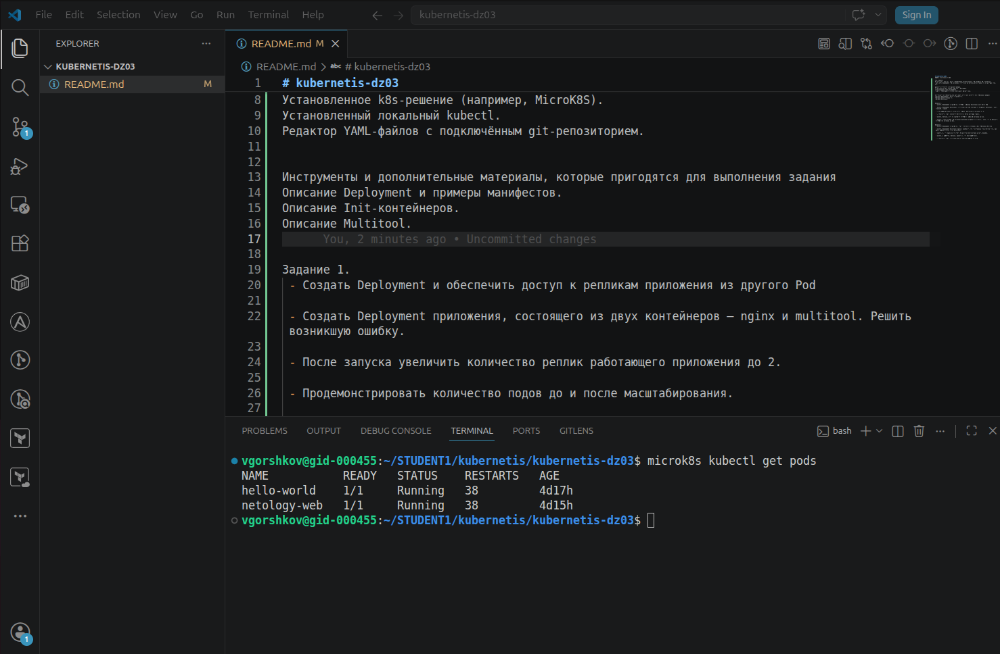


Задание 1. 
 - Создать Deployment и обеспечить доступ к репликам приложения из другого Pod
[text](deployment-1.yaml)

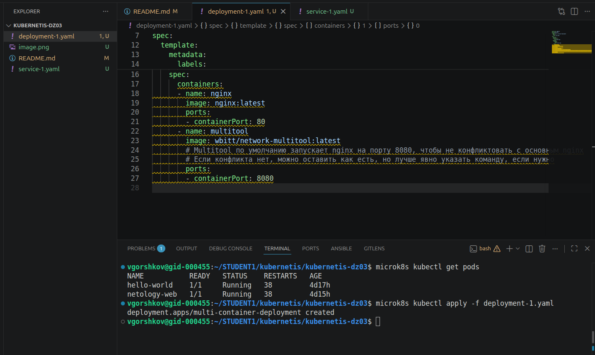

 - Создать Deployment приложения, состоящего из двух контейнеров — nginx и multitool. Решить возникшую ошибку.

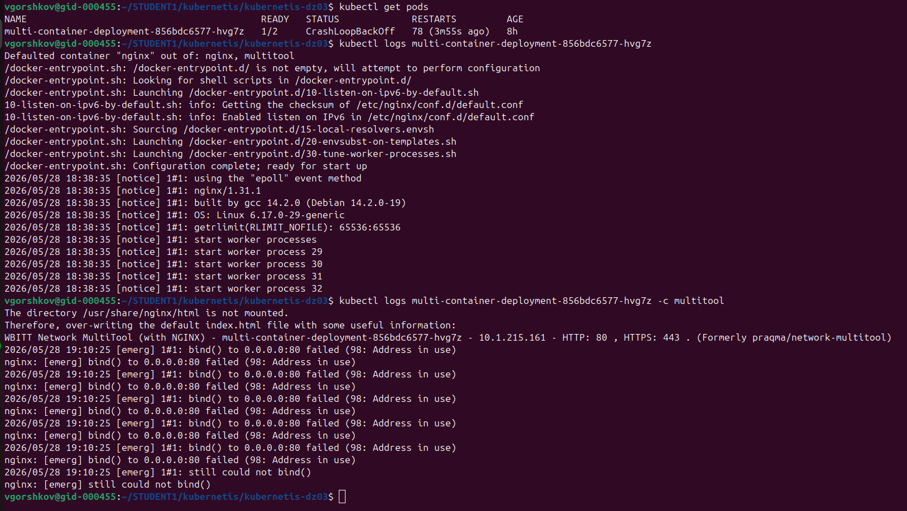

Trobleshutting
Так как nginx в multytool, и nginx используют один и тот же порт, multytool не может стартовать. Пропишем для поледнего порт 8081

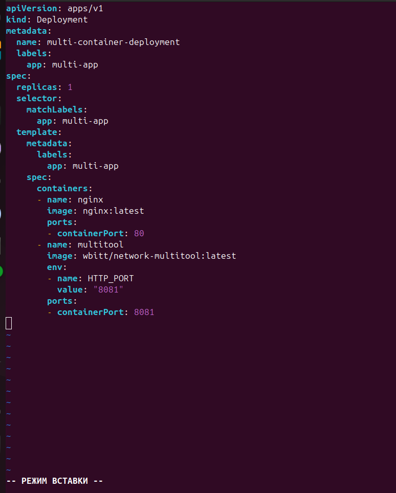

Пробуем еще раз

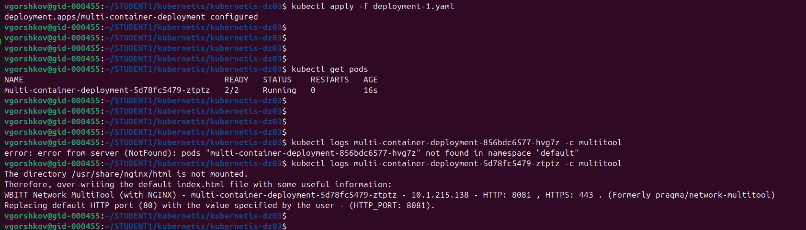

Запустились.

 - После запуска увеличить количество реплик работающего приложения до 2.
 
 Используем команду:
 ```
kubectl scale deployment multi-container-deployment --replicas=2
 ```
 - Продемонстрировать количество подов до и после масштабирования.
 
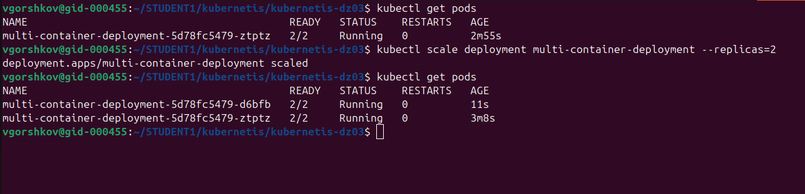

 - Создать Service, который обеспечит доступ до реплик приложений из п.1.
 [text](service-1.yaml)

Используем метку:
```
matchLabels:
      app: multi-app
```

Применим манифест:

```
kubectl apply -f service-1.yaml
```

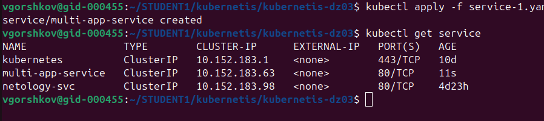

 - Создать отдельный Pod с приложением multitool и убедиться с помощью curl, что из пода есть доступ до приложений из п.1.

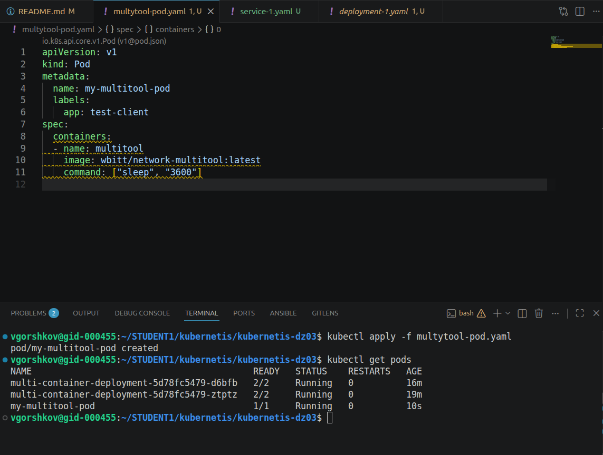

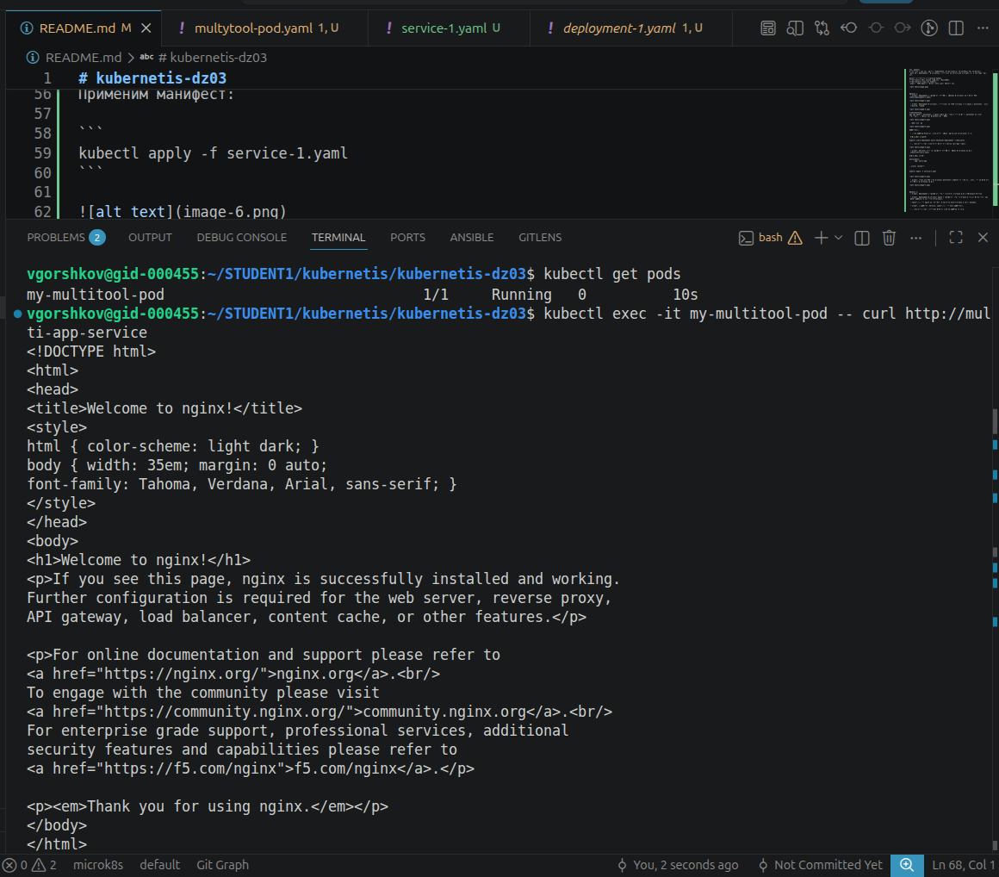

Задание 2. 
 - Создать Deployment и обеспечить старт основного контейнера при выполнении условий
[text](deployment-init.yaml)
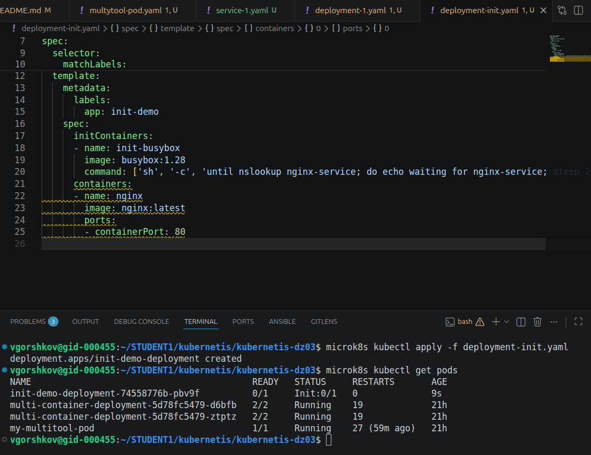

 - Создать Deployment приложения nginx и обеспечить старт контейнера только после того, как будет запущен сервис этого приложения.

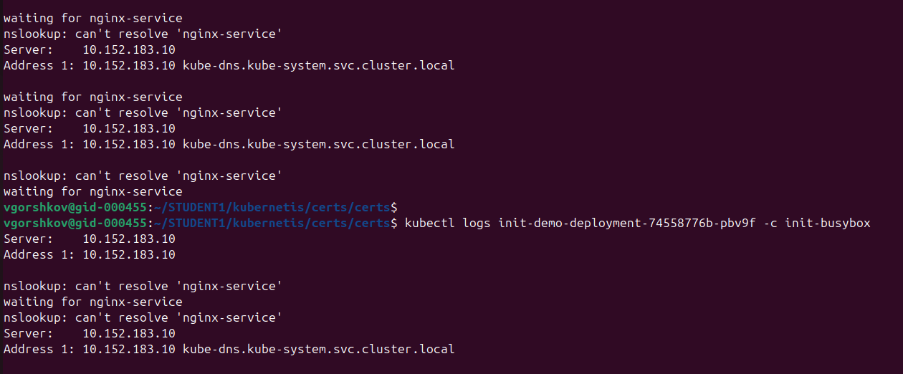

 - Убедиться, что nginx не стартует. В качестве Init-контейнера взять busybox.

Сервис не стартует, так как не может разрезолвить сервис "nslookup: can't resolve 'nginx-service'"

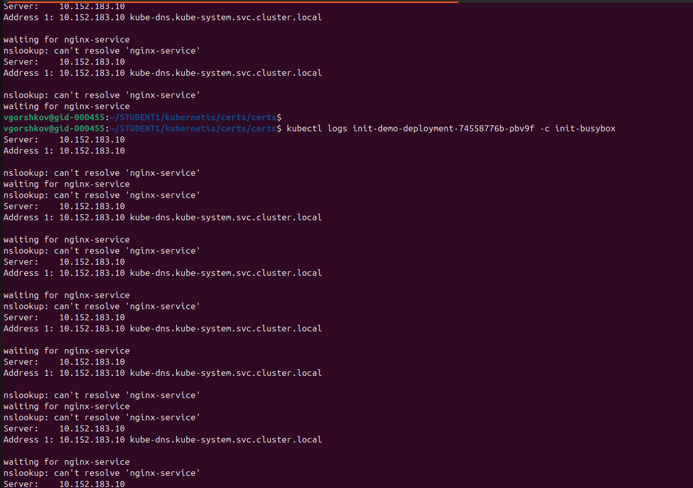

 - Создать и запустить Service. Убедиться, что Init запустился.

until nslookup nginx-service; do echo waiting for nginx-service; sleep 2; done
проверяем в цикле, пока не будет true внутри цикла

Создали сервис nginx
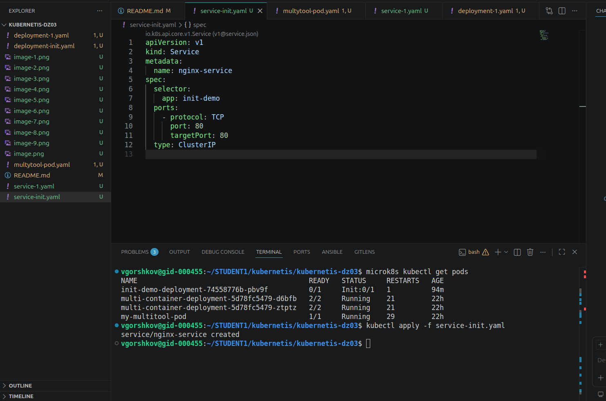

 - Продемонстрировать состояние пода до и после запуска сервиса.

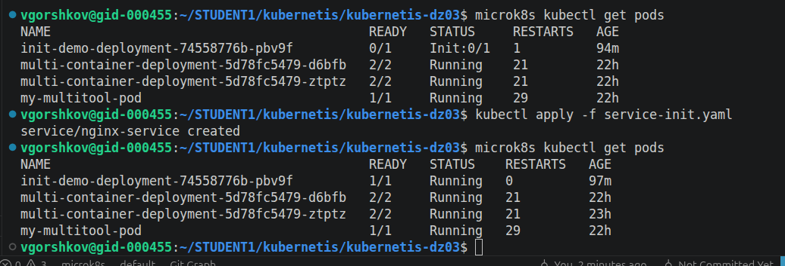

Видно что сервис запустился, 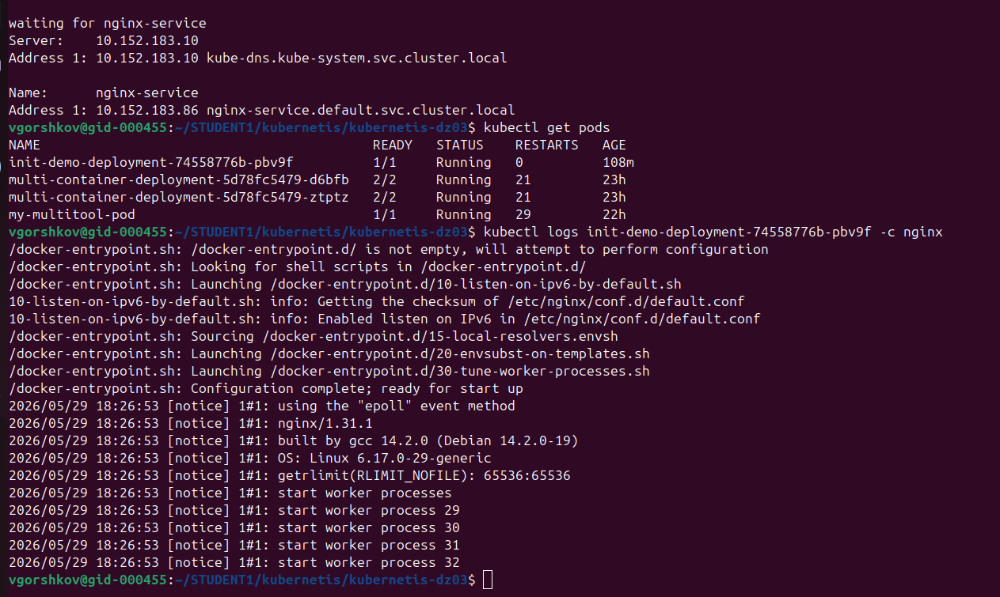 resolve выполнился.

сайт отвечает  
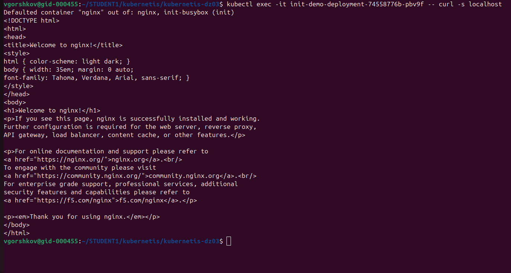

Спасибо, с  уважением Виктор.
